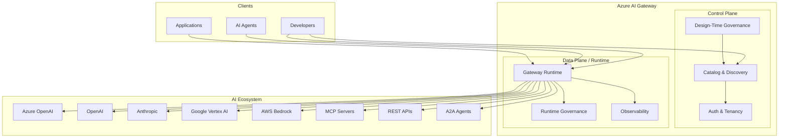

# Azure AI Gateway

## Overview

A multi-tenant platform that enables organizations to securely build, route, govern, and observe AI workloads across models, tools, and agents.

> **The control plane for AI workloads** — routing, governance, security, and observability across the full AI application stack.

**Key differentiators:**

- **AI-Native Asset Model** — models, tools, agents, skills, workflows, and connectors are first-class platform objects, not just API proxies
- **Namespace-Based Governance** — namespaces are the primary governance boundary, grouping assets, policies, credentials, and observability
- **Built-In Tool Governance** — tool catalogs, allowlists, invocation rate limits, credential management, and execution auditing
- **Enterprise Identity & Credentials** — JWT validation, Entra ID, managed identity for tools, namespace-scoped credentials
- **Safety & Compliance Controls** — PII detection, harmful content blocking, prompt injection detection, tool action guardrails
- **Advanced Routing & Resilience** — cross-region, multi-provider, PTU→PAYGO fallback, cost-aware and capability-aware routing
- **Full AI Workload Observability** — prompt/response tracing, tool invocation tracking, agent execution traces, token analytics, cost attribution by namespace
- **Cloud-Agnostic** — works with Azure OpenAI, OpenAI, Anthropic, Google Gemini, AWS Bedrock, and custom models

## Why Azure AI Gateway?

Unlike LiteLLM and Portkey which focus primarily on model routing and observability, or Kong and Cloudflare which extend traditional API gateways for LLM traffic, Azure AI Gateway provides a complete control plane for AI workloads — supporting agentic applications, tool governance, namespace-based access control, and enterprise-grade safety enforcement.

## Target Users

### Platform Engineers / Admins

- Define namespaces, policies, and credential scopes to govern AI workloads at scale
- Configure multi-provider routing, failover strategies, and cost controls across teams
- Monitor token usage, tool invocations, and agent behavior through unified observability

### AI Developers / Agent Builders

- Discover approved models, tools, and skills through governed catalogs
- Build agentic applications with standardized endpoints, built-in auth, and safety guardrails
- Compose multi-tool workflows without managing individual provider credentials

## Architecture



## First-Class Asset Types

| Asset | Description | Examples |
|-------|-------------|---------|
| **Models** | AI models from any provider | Azure OpenAI, OpenAI, Anthropic, Gemini, custom |
| **Tools** | APIs and services exposed to agents | REST APIs, SaaS connectors, internal services |
| **MCP Servers** | Model Context Protocol endpoints | Hosted or external MCP servers, API→MCP conversions |
| **Skills** | Higher-level constructs built on tools | Travel planning, finance analysis, HR workflows |
| **Agents** | AI agents consuming models + tools + skills | RAPI agents, A2A agents, custom agents |
| **Products** | Bundled collections for agent consumption | Curated packages of tools + models + skills |

## Core Capabilities

### For Platform Engineers / Admins

- **Register** models, tools, MCP servers, skills, and agents from any provider
- **Convert** OpenAPI APIs to MCP endpoints with zero code
- **Govern** with token quotas, rate limits, content safety, access control, IP filtering
- **Route** across model deployments with automatic failover (even cross-provider)
- **Observe** with logs, traces, metrics (including per-user token tracking)
- **Manage** multi-tenant catalogs with team-based visibility and RBAC

### For Developers / Agent Builders

- **Discover** approved AI assets through governed catalogs
- **Connect** through standardized endpoints with built-in auth and governance
- **Compose** by combining multiple tools and MCP servers behind unified endpoints
- **Test** with A/B traffic splitting across models without code changes

## Project Structure

```
src/
  gateway/          # Core gateway runtime — proxy, routing, mediation
    routing/        # Model routing, fallback, load balancing
    proxy/          # Request proxying and mediation
    policies/       # Runtime policy enforcement
  catalog/          # Discovery engine & asset registry
    models/         # Model registry
    tools/          # Tool registry
    mcp-servers/    # MCP server registry
    skills/         # Skill registry
    agents/         # Agent registry
  governance/       # Design-time & runtime governance
    design-time/    # Registration validation, schema checks
    runtime/        # Rate limiting, content safety, token mgmt
    audit/          # Audit logging
  auth/             # Auth & multi-tenant management
    tenants/        # Tenant provisioning & management
    identity/       # Identity, RBAC, API keys
  common/           # Shared types, utils, config
    types/          # Core entity types
    config/         # Configuration management
    utils/          # Shared utilities
tests/
  unit/
  integration/
docs/               # Product & architecture documentation
```

## Getting Started

### Prerequisites

- Node.js 20+
- npm 9+

### Setup

```bash
git clone https://github.com/anishta_microsoft/standalone-ai-gateway.git
cd standalone-ai-gateway
npm install
npm run build
```

### Portal (Web UI)

The AI Gateway portal is a React SPA built with Vite and Fluent UI, providing a unified experience for managing AI workloads.

```bash
cd portal
npm install
npm run dev          # Start at http://localhost:5173
```

### Development

```bash
npm run dev          # Start development server
npm run lint         # Run linter
npm run type-check   # TypeScript type checking
npm test             # Run tests
```

## Phased Build Plan

### Phase 1 — MVP

- Multi-provider model gateway with unified API
- Tool & MCP server catalog with governance
- Agent registration and runtime protection
- Single unified portal experience
- Serverless-first deployment

### Phase 2 — Fast Follow

- Content safety, semantic caching, A/B testing
- Skills as first-class entities, product bundles
- Approval workflows, delegated access (OBO)
- Enhanced MCP observability, intent-based discovery

### Phase 3 — Ecosystem

- GitHub Copilot CLI integration
- Advanced analytics (tool-agent-prompt correlation)
- Bundled capability discovery

## Documentation

| Document | Description |
|----------|-------------|
| [Product Vision](docs/product-vision.md) | Strategic context, target customers, guiding principles |
| [Architecture](docs/architecture.md) | System architecture, components, data flow |
| [Scenarios](docs/scenarios.md) | Full scenario matrix with priorities |
| [Competitive Analysis](docs/competitive-analysis.md) | Market landscape and differentiation |
| [MVP Scope](docs/mvp-scope.md) | Phase 1 deliverables and success criteria |
| [Entity Model](docs/entity-model.md) | First-class asset types and relationships |
| [Governance](docs/governance.md) | Namespace-based governance model and policy enforcement |
| [User Flows](docs/user-flows.md) | End-to-end user journeys for platform engineers and developers |

## Contributing

See [CONTRIBUTING.md](CONTRIBUTING.md) for development guidelines.

## License

MIT
