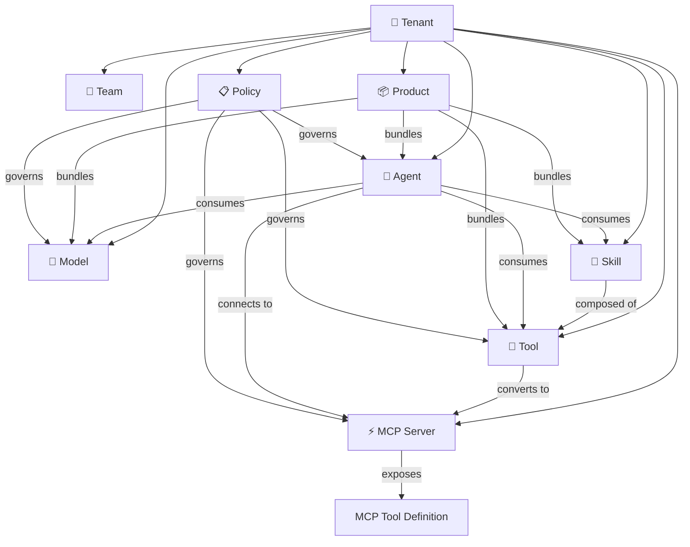
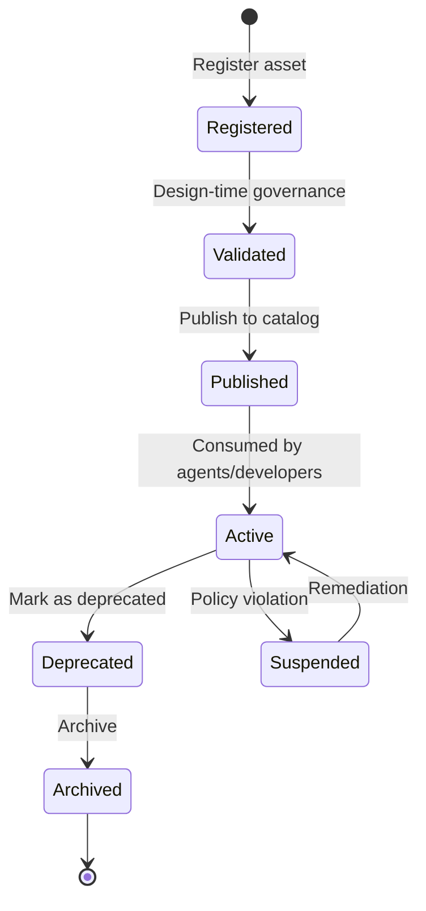

# Entity Model — Standalone AI Gateway

## First-Class Entities

The AI Gateway treats the following as core platform primitives:

### Entity Hierarchy

## Entity Definitions

### Tenant
The top-level organizational boundary. Everything is scoped to a tenant.
- Contains teams, which contain members
- Owns all assets (models, tools, agents, etc.)
- Has quotas (tokens/min, requests/min, max assets)
- Operates in a tier: `serverless` or `dedicated`

### Model
A registered AI model from any provider.
- **Provider**: Azure OpenAI, OpenAI, Anthropic, Google Vertex AI, AWS Bedrock, custom
- **Capabilities**: chat, completion, embedding, image, audio, vision
- **Cost config**: per-1k token pricing for cost tracking
- **Failover chain**: ordered list of backup models (can cross providers)

### Tool
An API or service that can be invoked by agents.
- **Transport**: REST, GraphQL, gRPC, MCP, custom
- **Auth**: API key, OAuth2, Entra ID, none, custom
- **Schema**: OpenAPI spec or JSON Schema for input/output
- **Visibility**: public, private, or team-scoped
- Can be **converted to an MCP server** for agent consumption

### MCP Server
A Model Context Protocol endpoint exposing tools to agents.
- **Hosting**: managed (gateway-hosted) or external
- **Transport**: stdio, SSE, streamable-http
- **Source**: can be created from an OpenAPI spec (API→MCP conversion)
- Exposes a list of **MCP Tool Definitions** (name, description, input schema)

### Skill
A higher-level construct composed of tools, prompts, and workflows.
- Built from multiple tools combined with logic
- Has its own input/output schema
- Reusable across agents
- Workflow steps: tool invocation, prompt template, condition, parallel execution

### Agent
An AI agent that consumes models, tools, and skills.
- **Protocol**: RAPI (request-response), A2A (agent-to-agent), custom
- Connected to models for reasoning
- Connected to tools and MCP servers for action
- Connected to skills for composed capabilities
- Governed by policies

### Product
A bundled collection of assets for simplified consumption.
- Groups models, tools, skills, agents, MCP servers
- Applies unified policies to the bundle
- Simplifies developer onboarding — subscribe to a product, get everything

### Policy
A governance rule applied to assets at design-time or runtime.
- **Design-time**: registration validation, schema checks, approval workflows
- **Runtime**: rate limiting, token quotas, content safety, access control, IP filtering
- Targets specific asset types or specific asset instances
- Composable — multiple policies can apply to the same asset

## Entity Lifecycle

## Relationships Summary

| From | To | Relationship |
|------|----|-------------|
| Tenant | Team | has many |
| Tenant | All assets | owns |
| Tool | MCP Server | can be converted to |
| MCP Server | MCP Tool Definition | exposes many |
| Skill | Tool | composed of many |
| Agent | Model | consumes many |
| Agent | Tool | consumes many |
| Agent | Skill | consumes many |
| Agent | MCP Server | connects to many |
| Product | Model, Tool, Skill, Agent | bundles many |
| Policy | Model, Tool, MCP Server, Agent | governs many |
